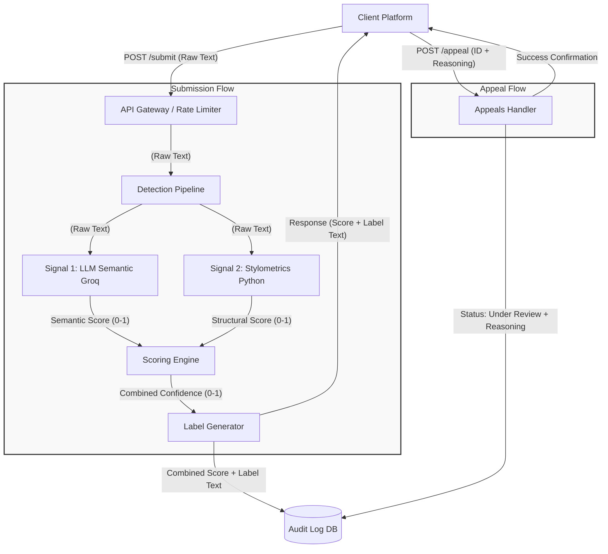

# Provenance Guard: System Specification & Planning

## 1. Detection Signals & Scoring Strategy
To ensure a robust classification system, Provenance Guard utilizes two independent signals that capture different properties of the submitted text. 

* **Signal 1: Semantic Analysis (LLM / Groq API)**
    * **What it measures:** Evaluates the stylistic coherence, predictability, tone, and presence of common AI conversational tropes (e.g., highly structured transitions, lack of emotional nuance). 
    * **Output:** A float between `0.0` (Highly likely Human) and `1.0` (Highly likely AI).
* **Signal 2: Structural Stylometrics (Python Heuristics)**
    * **What it measures:** Calculates sentence length variance (standard deviation of word counts per sentence). AI text tends to be highly uniform in rhythm, whereas human writing exhibits natural burstiness (mixing short punchy sentences with long complex ones).
    * **Output:** A float mapped between `0.0` (High variance / Human) and `1.0` (Low variance / AI).

**Combining the Signals:**
The final confidence score is a weighted average of both signals. Because LLMs are generally better at holistic analysis, Signal 1 will carry a **70% weight**, and Signal 2 will carry a **30% weight**.
> `Final Score = (Signal 1 * 0.7) + (Signal 2 * 0.3)`

## 2. Uncertainty Representation
A confidence score is not a binary switch; it represents a gradient of certainty. A score of `0.62` does not mean "AI"; it means the system detected mixed signals—for example, a human text that was heavily grammatically corrected by an AI tool, or an AI text prompted to be highly variable. 

**Threshold Mapping:**
* **`0.00` to `0.40` (Likely Human):** Both signals strongly indicate natural variability and tone.
* **`0.41` to `0.64` (Uncertain):** The signals conflict, or both return ambiguous middle-ground results. The system lacks the confidence to make a definitive claim.
* **`0.65` to `1.00` (Likely AI):** Both signals strongly indicate uniformity and AI-aligned semantic structure.

## 3. Transparency Label Design
Below is the exact, verbatim text that will be surfaced to users based on the mapped confidence score thresholds. 

| Classification | Score Range | Transparency Label Text (Verbatim) |
| :--- | :--- | :--- |
| **High-Confidence Human** | `0.00 - 0.40` | "High-Confidence Human: Our analysis indicates a strong likelihood that this content was naturally authored by a human." |
| **Uncertain** | `0.41 - 0.64` | "Uncertain Origin: Our system detected mixed signals. This content may be heavily edited human work, or AI-generated text modified to appear human." |
| **High-Confidence AI** | `0.65 - 1.00` | "High-Confidence AI: Our analysis strongly indicates this content was generated by artificial intelligence." |

## 4. Appeals Workflow
* **Who can appeal:** The authenticated creator (author) of the submitted content.
* **Information provided:** The `submission_id` and a text payload containing the creator's `reasoning` (e.g., links to draft histories, explanations of formatting).
* **System Action:** The system updates the `status` of the existing database record from `processed` to `under review`. It appends the creator's reasoning to the original audit log entry. The original classification scores remain untouched.
* **Reviewer View:** A human moderator opening the appeal queue will see a dashboard containing: The original text, the individual scores for Signal 1 and 2, the final confidence score, the assigned label, the timestamp, and the creator's verbatim reasoning.

## 5. Anticipated Edge Cases
Every heuristic has a blind spot. The system is anticipated to struggle with the following specific scenarios:
1.  **Academic & Technical Writing (False Positive):** A highly polished, heavily edited human thesis will likely have low sentence variance (triggering Signal 2) and a highly formal, rigid semantic structure (triggering Signal 1). The system will likely misclassify this as AI.
2.  **Children's Literature (False Positive):** Books designed for early readers rely on short, highly uniform sentence lengths and simple semantic structures. This combination of low variance and high predictability will likely fool the heuristics into scoring it as AI.
3.  **Prompt-Engineered Persona (False Negative):** An AI explicitly prompted to "write like a disjointed, angry teenager on an internet forum making frequent typos" will introduce artificial variance and break semantic formatting rules, scoring heavily as human.

---

## Architecture

The submission flow accepts text via the API gateway, processes it in parallel through the semantic and structural detection signals, calculates a combined confidence score, and returns a mapped transparency label while logging the entire transaction. The appeal flow allows creators to submit a contestation via a separate endpoint, which updates the original audit log entry's status to "under review" without overwriting the original scoring data.

## AI Tool Plan

### **M3 (Submission Endpoint + First Signal)**
* **Spec Sections to Provide:** `1. Detection Signals` (Signal 1 only) + the `Architecture Diagram`.
* **What to Ask For:** A basic API app skeleton (e.g., Flask or FastAPI) featuring a `POST /submit` endpoint. A separate function that takes a text string, calls the Groq API with a prompt designed to classify AI/Human, and parses the response into a float between 0.0 and 1.0. 
* **How to Verify:** Boot the server locally and send a cURL request to `/submit` with sample text. Verify it doesn't crash and successfully returns the 0.0-1.0 score from Groq.

### **M4 (Second Signal + Confidence Scoring)**
* **Spec Sections to Provide:** `1. Detection Signals` (Signal 2 & Combination logic) + `2. Uncertainty Representation` + the `Architecture Diagram`.
* **What to Ask For:** A pure Python function that calculates sentence length variance and normalizes it to a 0.0-1.0 scale. An update to the `/submit` endpoint that runs both signals concurrently and calculates the 70/30 weighted average.
* **How to Verify:** Submit a known block of ChatGPT output, followed by a deeply personal, messy human diary entry. Verify that the combined scores differ meaningfully and align with reality. 

### **M5 (Production Layer & Appeals)**
* **Spec Sections to Provide:** `3. Transparency Label Design` + `4. Appeals Workflow` + the `Architecture Diagram`.
* **What to Ask For:** Logic to map the combined float score to the exact label variants provided in the spec. A mock database or in-memory dictionary to handle the Audit Log. A `POST /appeal` endpoint that accepts an ID and reasoning, finds the log in the dictionary, and changes its status.
* **How to Verify:** Test the endpoint by forcing the scores to land in all three threshold buckets to ensure the exact label text is returned. Fire a `POST /appeal` request with the returned ID and verify via a `GET /log` (or by printing the memory dictionary) that the status successfully flipped to "under review".
